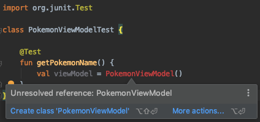
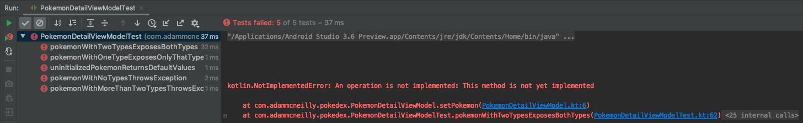
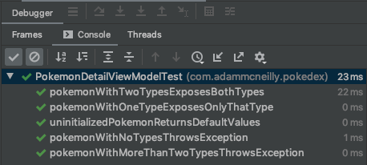

One of the many buzzwords thrown around the software devleopment community is Test Driven Development, or TDD. It is one of those phrases that sounds great when you say it - who wouldn't want to have tests be their first priority when writing code? 

However, it's not always clear what TDD means. Does it mean you write code with testability in mind? Does it mean writing tests first? How can we write tests if we don't have code _to_ test? This post will answer all of those questions, and teach you how to implement TDD effectively on Android. 

<!--more-->

# What Is TDD And Why Should We Use It?

TDD is a software methodology in which developers write the tests for pieces of code prior to writing the code itself. This means you will have a bunch of tests that cover your expected behavior, and they will fail, until you write the code required to make them pass.

There's a few benefits to TDD:

1. If you write the test cases for a particular piece of code first, you force yourself to consider the different constraints that apply to that code. As a result, the implementation of that code can happen a lot faster, because you've already planned how it should work. 

2. Having tests in place right away allows you to write code with confidence. You've already defined how the code is expected to work, and once all of your tests are passing, you can be confident that the code you wrote works as intended. This is slightly more nuanced than writing tests after the fact - because we may have unknowingly written a test to work around code as it is, and not as it _should_ be. 

3. This is true regardless of when you write the tests, but having tests for your code allows you to maintain that code with confidence. As you refactor and update code, you can rely on your tests to notify you if you made a breaking change, or ship that change with confidence by not breaking the contract defined by the tests.

# What Makes TDD Hard To Adopt?

Up to this point, TDD may sound like a great strategy. It's all the benefits of testing, but by prioritizing it earlier in the development process we get additional benefits like writing our code with confidence and developing that code faster. In practice, though, this can be really tricky for a lot of developers. 

Let's consider we start writing a unit test for some ViewModel class before we write the ViewModel itself. Immediately, we're going to end up in a situation like this:



Since the class doesn't exist, the IDE is going to complain that the reference isn't found. This means my tests won't even compile, nor will we get the auto complete support that many developers are used to.

This may feel like a big barrier to entry for TDD. We're already dealing with the learning curve of writing failing tests first, but trying to write tests that don't compile is even more difficult.

# How To Effectively Implement TDD

Thankfully, we can still work around those concerns. Let's talk now about how we can support TDD, and implement it in an effective way that helps us gain confidence in the code we write.

## An Example Component

For this post, let's consider making a `PokemonDetailViewModel`, that given a `Pokemon` model will conditionally show some information about the Pokemon, like its name and types. Pokemon can have up to two types, but we only want to show the second one if it exists. 

## Creating A Minimal Implementation

We begin by defining the contract of information that will be exposed to us, but instead of using real values, we can leverage Kotlin's [TODO](https://kotlinlang.org/api/latest/jvm/stdlib/kotlin/-t-o-d-o.html) method, which will satisfy the compile time needs, but throw a `NotImplementedError` when called:

```kotlin
class PokemonDetailViewModel {

    fun setPokemon(pokemon: Pokemon) {
        TODO("This method is not yet implemented")
    }

    val pokemonName: String
        get() = TODO("This field is not yet implemented.")

    val firstType: String
        get() = TODO("This field is not yet implemented.")

    val secondType: String?
        get() = TODO("This field is not yet implemented.")

    val showSecondType: Boolean
        get() = TODO("This field is not yet implemented.")
}
```

## Developing A Test Plan

Next, let's think about each possible state that this ViewModel could be in. We need to be rigorous, and really consider all options:

1. What should we do if no Pokemon is supplied?
2. What should we do if we're supplied a Pokemon with no types?
3. What should we do if we're supplied a Pokemon with only one type?
4. What should we do if we're supplied a Pokemon with two types? 
5. What should we do if we're supplied a Pokemon with more than two types?

This thought process is a crucial benefit of TDD. Without it, we may have looked at the code sample above, built the getter methods, and never really considered all of the possible constraints or invalid inputs. 

For the purpose of this example, we'll take the following approaches:

1. If no Pokemon is ever supplied, we'll expose default values of empty strings.
2. If a Pokemon with an invalid number of types is supplied, we'll throw an exception.
3. If a Pokemon is supplied with valid information, we'll expose the correct name and type information. 

## Write Our Tests

Given the minimal implementation above, we have everything to write our tests. Let's look at a couple:

```kotlin
class PokemonDetailViewModelTest {

    @Test
    fun uninitializedPokemonReturnsDefaultValues() {
        val viewModel = PokemonDetailViewModel()

        assertEquals("", viewModel.pokemonName)
        assertEquals("", viewModel.firstType)
        assertNull(viewModel.secondType)
        assertFalse(viewModel.showSecondType)
    }

    @Test
    fun pokemonWithOneTypeExposesOnlyThatType() {
        val viewModel = PokemonDetailViewModel()

        val testPokemon = Pokemon(
            name = "Squirtle",
            types = listOf("Water")
        )

        viewModel.setPokemon(testPokemon)
        assertEquals("Squirtle", viewModel.pokemonName)
        assertEquals("Water", viewModel.firstType)
        assertNull(viewModel.secondType)
        assertFalse(viewModel.showSecondType)
    }
}
```

If you'd like to see all five tests, you can find them in this [gist](https://gist.github.com/AdamMc331/c815f3ae7579409b01b0fbfd5c9984aa).

When we run those tests, we will see that they are all failing as a result of our `NotImplementedError`:



## Make Our Tests Pass

With our defined contract of behavior, and tests covering all cases we expect, we can go into our actual code now and implement the required fields. We don't need to make all tests pass at once, though, so let's start by handling the happy paths. Here is what our ViewModel may look like:

```kotlin
class PokemonDetailViewModel {
    
    private var pokemon: Pokemon? = null

    fun setPokemon(pokemon: Pokemon) {
        this.pokemon = pokemon
    }

    val pokemonName: String
        get() = this.pokemon?.name.orEmpty()

    val firstType: String
        get() = this.pokemon?.types?.first().orEmpty()

    val secondType: String?
        get() = this.pokemon?.types?.getOrNull(1)

    val showSecondType: Boolean
        get() = this.secondType != null
}
```

We will see that we made three of our tests pass, but not the ones that had invalid input:


To fix those, we just need to update our `setPokemon` method to throw the relevant exception:

```kotlin
class PokemonDetailViewModel {

    fun setPokemon(pokemon: Pokemon) {
        val typeCount = pokemon.types.size
        if (typeCount <= 0 || typeCount > 2) {
            throw IllegalArgumentException("Pokemon has an invalid number of types.")
        }
        
        this.pokemon = pokemon
    }
}
```

Now, all of our tests are passing:



You can see the full ViewModel as part of the [gist](https://gist.github.com/AdamMc331/c815f3ae7579409b01b0fbfd5c9984aa), too. 

# Recap & Tips

I hope this post has alleviated some concerns and fears you had for implementing TDD. Let's go over everything that we learned:

1. TDD is important because it forces us to think carefully about the code we write. 
2. It allows us to write code faster and with more confidence, thanks to that planning step. 
3. We can leverage Kotlin's TODO method to create a minimal implementation that allows us to write tests using code completion and other IDE tools. 
4. Write tests to cover all functionality expected for the component you're building. 
5. Replace all of our TODO calls with the actual implementation to get those tests to pass. 

While this may feel like a lot, keep in mind that TDD does not have to be an all-or-nothing implementation. You don't need to change your entire development process over night. I encourage you to try this process next time you make a small class, or are writing a few utility methods. This will help you become familiar with the process, and determine what works for you before using this approach at a larger scale. 
